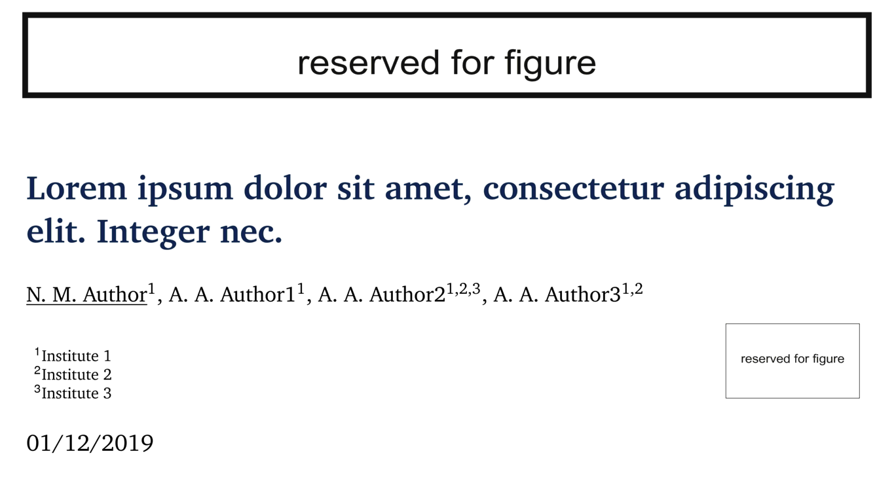

# Beamer simple conference presentation

These are the slides I used to give a simple conference talk based on Johannes Dorfner theme (or TUM theme?) - [ojdo/thesis-defense](https://github.com/ojdo/thesis-defense). It utilizes XCharter fonts that support Cyrillic.

## Preview

Preview was made by (you need Imagemagick with legacy support of 'convert' installed)

'''
convert -density 600 BeamerPresentation.pdf -strip -resize @1048576 PNG8:slide-%02d.png
convert -layers OptimizePlus -delay 120 slide-??.png -loop 0 BeamerSlides.gif
'''

*via [Converting PDF slides to animated GIFs and videos with ImageMagick](http://phyletica.org/imagemagick/) by [Jamie Oaks](http://github.com/joaks1).*
